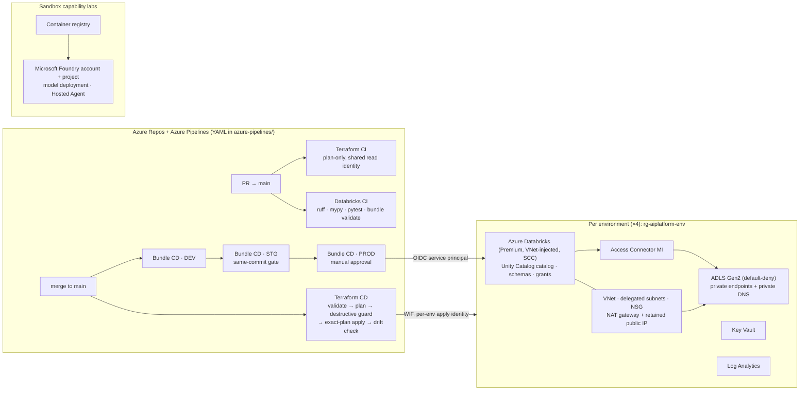

# Azure AI Platform — portfolio edition

A personal engineering and learning project: a small, production-shaped
Azure ML/AI platform built end to end with **Terraform**, **Azure Databricks**,
**Azure DevOps pipelines**, **Unity Catalog**, **MLflow**, **Microsoft Foundry**
and Python. It was designed, deployed and operated in a real Azure
subscription over roughly twenty engineering phases; this repository is a
**sanitized snapshot** of that work prepared for technical review.

> **What this is not.** It is not an employer's production system and it does
> not claim business outcomes. Every subscription, tenant, workspace, storage
> and service-principal identifier has been replaced with a synthetic example
> (see [About this edition](#about-this-edition)). Nothing in this repository
> can deploy to, or bill, a cloud account as published.

## What it demonstrates

| Area | Evidence in this repository |
|---|---|
| **Infrastructure as code** | Environment-neutral Terraform modules composed into four environment roots (`sandbox`, `dev`, `stg`, `prod`), one remote state per environment, `moved` blocks for safe refactors, `prevent_destroy` on durable resources, private-endpoint storage, VNet-injected Databricks with Secure Cluster Connectivity |
| **CI/CD with governance** | One plan-only CI and one controlled-apply CD architecture for all environments: workload identity federation only (no secrets), separate plan/apply identities, exact-plan promotion, a destructive-change guard, post-apply drift check, manual approval on PROD |
| **Databricks delivery** | Declarative bundles promoted DEV → STG → PROD by same-commit provenance, per-environment OIDC service principals, Unity Catalog catalogs/schemas/grants managed in Terraform |
| **ML lifecycle** | `ml-lifecycle-demo`: train → register → validate → promote with MLflow aliases (Candidate/Champion), an evaluation gate, batch inference, scheduled monitoring and controlled retraining, with the release decision separated from the code deploy |
| **LLM application engineering** | `platform-engineering-assistant`: grounded question answering over an enumerated corpus with fail-closed grounding, credential scanning of the corpus, prompt versioning, telemetry, and an evaluation suite with adversarial cases and quality gates |
| **Controlled agents** | A bounded agent with explicit tool allow-lists, structured decisions, human approval for consequential actions and an audit trail; the same agent orchestrated by Microsoft Foundry and packaged as a Foundry Hosted Agent; a read-only "why did model X degrade?" operations agent on Databricks Apps |
| **Platform operations** | A reversible **idle mode** that removes hourly-billed networking while preserving data, identities and restoreability, enforced by the CD guard and a product-deployment gate; cost-controlled GPU lab design with an expiry watchdog |
| **Engineering practice** | Thirteen ADRs, runbooks, a product contract and template, table-driven shell tests for CI gates, `uv`/Ruff/mypy/pytest across all Python projects |

## Architecture



State: one Azure Blob backend, keys `platform/<env>.tfstate`, Entra ID auth,
no storage keys. Identity: workload identity federation everywhere; there are
no PATs, client secrets or SAS tokens anywhere in the delivery path.

## Repository map

```
infrastructure/
  modules/            network · storage · storage_private_access · key-vault · log-analytics
                      databricks-workspace · databricks-access-connector · databricks_product_uc · ai-foundry
  environments/       sandbox/ dev/ stg/ prod/ — identical composition, one state each,
                      platform_mode.tf = committed idle/active switch
  capabilities/       ai-foundry/sandbox (Foundry + ACR), aks-mlops (GPU lab, controls + session)
bootstrap/            Terraform state backend bootstrap
backend/              backend configuration files (synthetic account names)
azure-pipelines/      Terraform CI/CD, Databricks bundle CI/CD (dev → stg → prod), Foundry CD
scripts/ci/           terraform-plan.sh · terraform-cd-apply.sh · terraform-cd-drift-check.sh
                      check-destructive-plan.sh · check-platform-mode.sh · verify-promotion.sh
scripts/idle/         capture / suspend / restore workloads · verify-network-mode
tests/ci/             table-driven bash tests for the CI gates
products/
  hello-databricks/               minimal governed bundle that proves the promotion chain
  ml-lifecycle-demo/              classical ML lifecycle: candidate → champion, monitoring, retraining
  engineering-test-platform/      containerised inference service (FastAPI, kind/Helm)
  platform-engineering-assistant/ grounded LLM assistant + controlled agent + evaluation gates
  ml-platform-operations-agent/   read-only ML operations agent on Databricks Apps
  pet-classifier/                 image classifier, local CPU baseline → AKS GPU lab design
  _template/                      product contract scaffold
labs/
  foundry-capability-lab/         Foundry data-plane capability proofs
  agent-ecosystem/foundry-agent/  the controlled agent orchestrated by Foundry
  agent-ecosystem/hosted-agent/   the controlled agent packaged as a Foundry Hosted Agent
docs/
  adr/                thirteen architecture decision records
  runbooks/           Terraform CI/CD, state recovery, platform idle mode
  platform/           current state, engineering workflow, naming standard, product contract
  architecture.md · implementation-backlog.md
```

## Where to start reviewing

1. **`docs/adr/`** — read 0003 (CI/CD identity model), 0005 (four-environment
   foundation), 0007 (LLM evaluation gates), 0008 (controlled agent) and 0013
   (idle mode). They explain the *why* behind everything else.
2. **`azure-pipelines/templates/terraform-cd-stages.yml` with
   `scripts/ci/check-destructive-plan.sh` and `tests/ci/test-check-destructive-plan.sh`**
   — the controlled-apply path: plan under a read-only identity, guard, apply
   the exact reviewed plan under a per-environment identity, prove no drift.
3. **`products/ml-lifecycle-demo/`** — `README.md`, `resources/job.yml`,
   `src/validate_candidate.py`, `src/monitor.py`: how model promotion is kept
   separate from code promotion and how retraining is gated.
4. **`products/platform-engineering-assistant/`** —
   `src/platform_engineering_assistant/{grounding.py,corpus/,agent/}` and
   `evaluation/`: fail-closed grounding, corpus admission rules, credential
   scanning, structured agent decisions with an explicit approval-required
   outcome, and the evaluation policy files.
5. **`infrastructure/modules/network/main.tf`,
   `infrastructure/modules/storage_private_access/main.tf` and
   `docs/runbooks/platform-idle-mode.md`** — a real cost-management change
   made safely: conditional resources with `moved` blocks, exact-address guard
   allow-listing, snapshot-driven workload suspension and verified restore.

## Local setup and offline checks (no Azure required)

Prerequisites: Python 3.12, [`uv`](https://docs.astral.sh/uv/), Terraform ≥ 1.9,
optionally `tflint` and `trivy`.

```bash
# repository-wide formatting, lint and the root unit tests
uv run ruff format --check .
uv run ruff check .
uv run pytest -q

# CI gate contracts (pure shell + python, no cloud)
tests/ci/test-check-destructive-plan.sh
tests/ci/test-verify-promotion.sh

# every Terraform root and module, backend disabled
terraform fmt -check -recursive
make validate

# product unit suites (each project has its own uv environment; run from a git
# checkout — the assistant's corpus loader locates documents from the repo root)
for p in products/ml-lifecycle-demo products/engineering-test-platform \
         products/platform-engineering-assistant products/ml-platform-operations-agent \
         labs/foundry-capability-lab labs/agent-ecosystem/foundry-agent labs/agent-ecosystem/hosted-agent; do
  (cd "$p" && uv sync && uv run pytest -q)
done
```

Offline results recorded for this edition on 2026-09-25 (macOS, Python 3.12,
Terraform 1.15): 17 Terraform roots/modules validate; Ruff clean; root 4,
`ml-lifecycle-demo` 168, `engineering-test-platform` 13,
`platform-engineering-assistant` 1097, `foundry-capability-lab` 216,
`foundry-agent` 159, `hosted-agent` 65 tests passed, plus 22 + 17 shell gate
cases. `ml-platform-operations-agent` needs `uv sync --all-groups` (its live
adapters are a separate dependency group): 489 passed with 1 pre-existing
failure that also fails in the source repository and is unrelated to
sanitization. `pet-classifier` (torch) was not executed here; see its README.

`make check` runs the same gates the Azure DevOps pipelines run
(`fmt-check`, `validate`, `lint`, `typecheck`, `security`, `test`).
`.github/workflows/offline-validation.yml` executes a subset of these on
GitHub with read-only permissions, no credentials and no model calls.

Anything that talks to Azure, Databricks or a model endpoint is behind an
explicit environment variable or CLI profile and is documented per project as
a *manual live check*; none of it runs from the tests.

## How the pieces fit together

- **Terraform** owns durable platform infrastructure: networking, storage,
  Key Vault, Log Analytics, the Databricks workspace and Access Connector, and
  the Unity Catalog governance objects (storage credential, external location,
  catalog, product schemas and grants). Each environment root composes the
  same modules with different values; nothing environment-specific lives in a
  module.
- **Azure DevOps pipelines** are the only path that applies Terraform or
  deploys a bundle. `terraform-ci-platform.yml` plans every environment on a
  PR under one read-only identity; `terraform-cd-platform.yml` runs on merge,
  applies sandbox/dev/stg after their guards and prod after a manual
  approval, always from the exact reviewed plan. The YAML is included as
  implementation evidence; GitHub does not execute it.
- **Databricks bundles** own workloads: jobs, schedules, apps. Each product's
  `databricks.yml` pins a per-target workspace, `run_as` service principal,
  catalog and schema. `databricks-dev-cd.yml` deploys on merge; STG and PROD
  pipelines are triggered only by the previous stage's completion and
  re-verify that they are deploying the same commit (`scripts/ci/verify-promotion.sh`).
- **Identity** is workload identity federation from Azure DevOps for Azure,
  and `azure-devops-oidc` service principals for Databricks. Every Databricks
  pipeline asserts at runtime that the authenticated principal is the one it
  expects.

## Model lifecycle, evaluation and governance patterns implemented

- **Candidate vs Champion** (`ml-lifecycle-demo`): the code deploy registers
  and validates a *Candidate*; promotion to *Champion* is a separate, audited
  MLflow alias change behind its own PROD approval. Aliases are state; tags are
  provenance. The evaluation threshold is enforced inside training, so a model
  that fails it fails the pipeline.
- **Monitoring and controlled retraining**: a scheduled monitor computes
  feature drift (standardized mean difference against the training baseline)
  and performance signals, and only when it asks for it does the expensive
  retraining branch run; the schedule is deployed everywhere but `UNPAUSED`
  only in PROD.
- **LLM quality gates** (`platform-engineering-assistant`, ADR 0007): locked
  retrieval and generation datasets, an answered/refused invariant, adversarial
  prompt-injection and credential-exfiltration cases, and a policy file that
  fails the build below threshold.
- **Controlled agent** (ADR 0008–0011): tool allow-list, argument validation,
  bounded loop with retry limits, structured decision records, human approval
  before any consequential action, and an audit trail with prompt/tool/latency
  telemetry. The same control model is then hosted by Foundry rather than
  rewritten.
- **Read-only operations agent** (`ml-platform-operations-agent`): explains a
  model degradation from MLflow and Unity Catalog evidence with citations and
  an enforced read-only adapter boundary.

## Reversible idle mode (cost management, ADR 0013)

Measured spend was dominated by four NAT gateways and eight storage private
endpoints that do nothing while no compute runs. Idle mode:

- is a **committed switch per environment** (`platform_mode.tf`) that Terraform
  CI, CD and the drift check all read, and that no pipeline variable can
  override;
- removes exactly six resources per environment (NAT gateway, its three
  associations, two private endpoints) via `count`, with `moved` blocks so the
  refactor itself is a zero-change plan;
- retains the public IP (external allow-lists reference it), private DNS zones
  and links, storage, Key Vault, workspace, Unity Catalog and identities, and
  leaves storage firewall posture unchanged;
- is enforced by the CD guard (exact-address, delete-only allow-list) and by a
  gate that blocks product deployments into an idle environment;
- ships snapshot-driven scripts to suspend and later restore only the
  workloads that were previously active, and a live verifier for both modes.

All four environments were placed in idle mode with this code and verified;
the runbook records the measured before/after inventory with example
identifiers.

## Limitations and what was verified where

- **Historically deployed, not re-verified here:** the four Azure
  environments, the Databricks promotion chain, Unity Catalog objects, the
  Foundry account, Hosted Agent and the AKS GPU lab controls were built and
  exercised in a private subscription. This edition cannot reach that
  subscription; claims about live behaviour come from the ADRs and runbooks
  written at the time.
- **Verified in this edition:** Terraform formatting and validation of every
  root and module (backend disabled), Ruff, the shell gate tests and the
  offline unit suites listed above.
- **Not included:** Terraform state, plans, workload snapshots, credentials,
  datasets and model binaries, local tool configuration, agent-assistant
  instruction files, and an unmerged branch that restructures the operations
  agent into a LangGraph lab (it deletes a merged product and was left out
  rather than combined).
- **Included from unmerged feature branches, clearly additive:** the idle-mode
  implementation (with all four environments switched to idle) and the
  `pet-classifier` phases G1–G3 with the `aks-mlops` cost-control roots
  (designed and planned, never applied).
- The Foundry Hosted Agent's default-deny network path was never proven; ADR
  0011 says so explicitly.
- Sandbox is an experimentation class, not a promotion stage; its Unity
  Catalog objects are not Terraform-managed.

## About this edition

The content is a curated export of committed source from the operational
repository, produced from an explicit allow-list of paths rather than a copy
of a working directory. Identifiers were replaced consistently so that
relationships between files still hold: the subscription ID, tenant-scoped
service principal client IDs, Databricks workspace IDs and hosts, storage
account, registry and Foundry account names, public IP addresses (now in
documentation ranges), the Azure DevOps organisation and personal paths.
Resource-group, Key Vault and workspace *logical* names follow the naming
standard and were kept. Backend configuration files keep their structure with
example account names. No credential of any kind existed in the source tree;
the export was scanned with gitleaks and Trivy before publication.

No open-source licence has been granted for this repository at this time.
